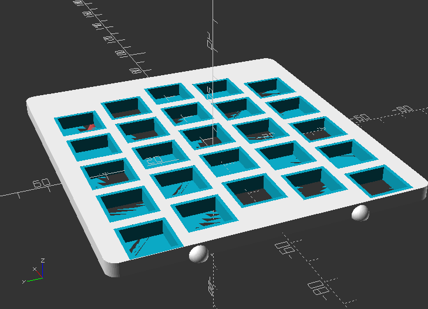
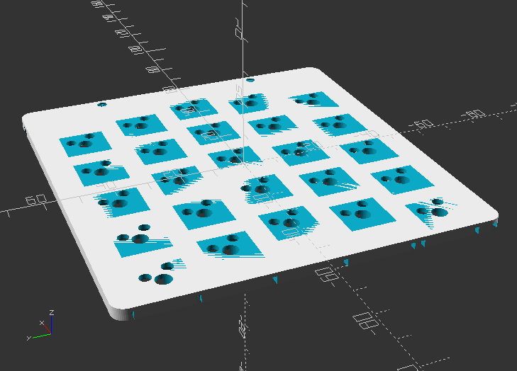
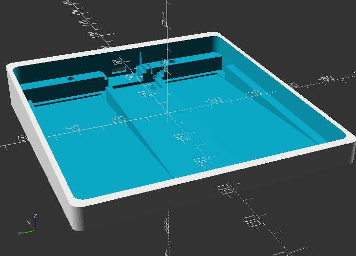
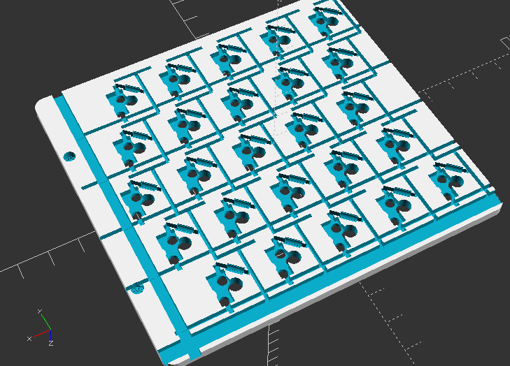

# A macro pad for milo
This was a project to make a macro pad with hotswap switches as a gift.
but the openscad code takes the number of rows, and columns, and gererates the keyboard in 3 pices, so it's possibly useful for others. (but the code, is not verry pretty)

Change `render_swap` from 1 to -1 to see the 3 pices.  
Setting `switch_number_x` and `switch_number_y` sets the size of the keyboard.  
the placement of the keys is ortholinear, and changing the values of any of the `switch_cosine_*` variables changes the curvature of the keys. (setting `switch_cosine_amplitude=0;` make them a grid with no curvature.)

There are a bunch of other variables for stuff since the keyboard is not entirely parametric. They are there to make it easier to correct issues that arrise when changing to extreme amplitudes, and different sizes.

The middle layer may work without soldering, but i havent tried as i don't trust it to last as long.

| Top plate view | Middle plate view | Bottom view |
|----------|------|-------|
|  |  |  |
|  |  |  |